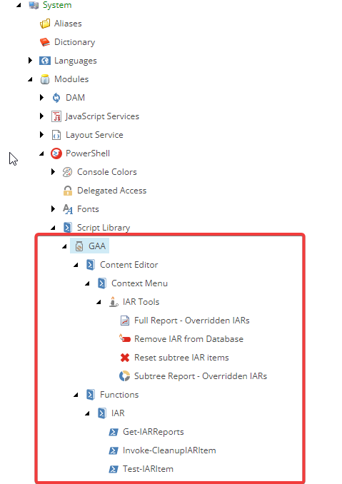
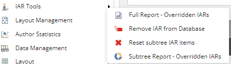
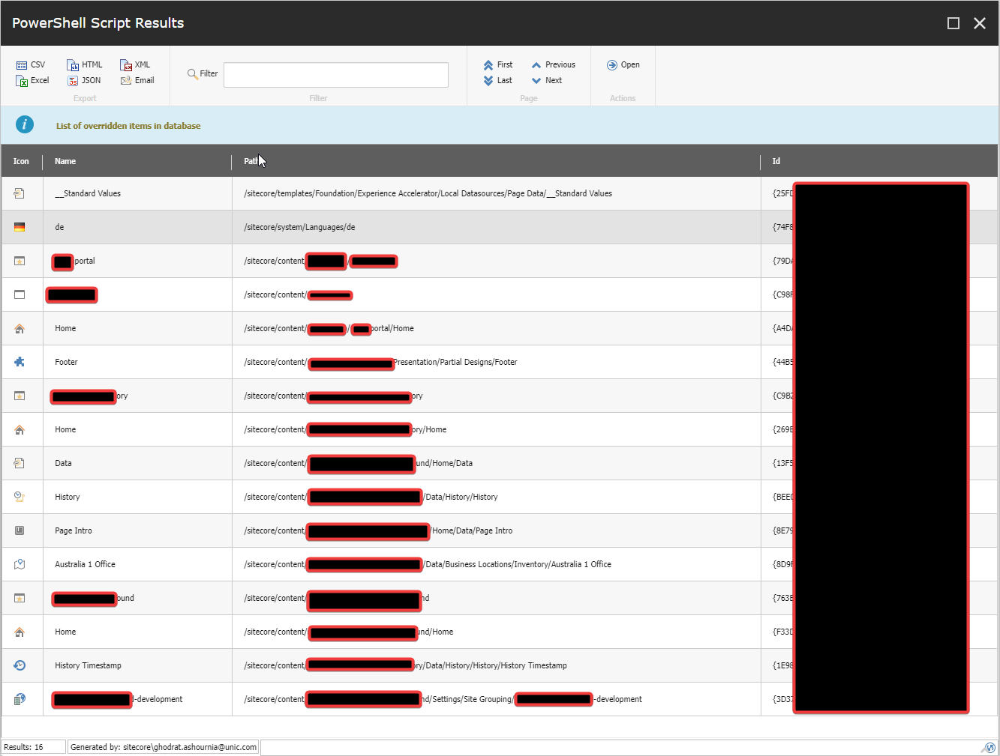

# Sitecore.IAR.Management

Powershell script for managing Item as resources.

The existing challenges with IAR deployments are described here: https://www.ashournia.com/item-deployment-in-sitecore-xmcloud/

In this Repository you will find the serilized powershell scripts mentioned in the blog post.
You can use the serilized items or [Sitecore package](https://github.com/GAAOPS/Sitecore.IAR.Management/releases/download/1.0/IAR-Management-1.zip) to install the scripts.

After installation you will have these items:

Using the reporting functions you can see which IAR items are overridden in the database:

**Important:** 
- Current implementation of the Reporting, does not use Solr, and it may have performance implications.
- The clean-up scripts, as described in the blog may use sql command to delete the items directly from database, **Read the source, test it and use it at your own risk!**
